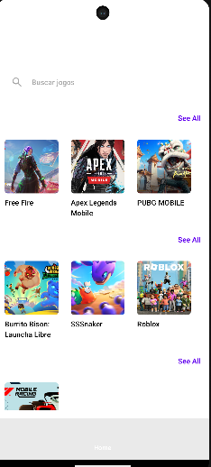
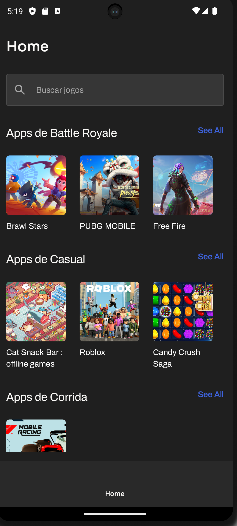

# siprogo_example

This project is an implementation example of Siprogo.

# Index
* [Introduction](#introduction)
  * [Compilation and Prerequisites](#compilation-and-prerequisites)
* [Installation](#installation)
  * [settings.gradle](#settingsgradlekts--project-root-)
  * [build.gradle](#buildgradle--app-)
* [Quick Start](#quick-start-guide)
  * [Code Example](#code-example)
* [Themes](#themes)
  * [Code Example Theme](#code-example---theme)


## Introduction
Siprogo is a solution developed in [Kotlin](https://kotlinlang.org/) that facilitates the distribution and customization of content,
requiring only the importation, resolution of dependencies, and implementation of
resources.

## Compilation and Prerequisites
To access the artifacts, you need to have an `authentication token` on [Jitpack](https://jitpack.io/),
as well as the `secretKey` of your organizations.

Siprogo is compiled with the following parameters:

```
android{
    compileSdk = 34
    ...    
        defaultConfig {
            minSdk = 24
            ...
        }
        
        compileOptions {
            sourceCompatibility = JavaVersion.VERSION_17
            targetCompatibility = JavaVersion.VERSION_17
        }
        kotlinOptions {
            jvmTarget = "17"
        }
        buildFeatures {
            compose = true
        }
        composeOptions {
            kotlinCompilerExtensionVersion = "1.4.3"
        }
        ...
```

## Installation
Access to the library is via [Jitpack](https://jitpack.io/) and should be added to the dependencies
and assembly of the project/application.

### settings.gradle.kts (project root)
``` 
    dependencyResolutionManagement {
    ...
    maven {
        url = uri("https://jitpack.io")
        credentials {
            username = "YOUR_TOKEN"
        }
    }
    ...
    
```

### build.gradle (app)

```
dependencies {
    implementation ("com.github.Digita1Reef.siprogo:sdk:[tag]")
    ...
```

## Quick Start Guide
Once the imports are done and the project is synchronized, various packages become available for partial or total implementation of the resources.

For full implementation, the `SDKImplementation` method contained in the package
`com.siprocal.siprogo.sdk` should be implemented, with the following constructor:

```
SDKImplementation (
    context: android.content.Context, 
    secretKey: kotlin.String,
    theme: SiprogoThemeDefinition?
)  
```

### Code Example
The implementation at the Activity level is exemplified below.

```
package com.example.myapplication

import android.os.Bundle
import androidx.activity.ComponentActivity
import androidx.activity.compose.setContent
import androidx.compose.runtime.Composable
import androidx.compose.ui.platform.LocalContext
import androidx.compose.ui.tooling.preview.Preview
import com.siprocal.siprogo.sdk.SDKImplementation

class MainActivity : ComponentActivity() {
    override fun onCreate(savedInstanceState: Bundle?) {
        super.onCreate(savedInstanceState)
        setContent {
            MainActivityContent()
        }
    }
}

@Composable
fun MainActivityContent() {
    SDKImplementation(
        context = LocalContext.current,
        secretKey = "[ORGANIZATION_SECRETKEY]"
    ).renderApp()
}

@Preview(showBackground = false)
@Composable
fun GreetingPreview() {
    MainActivityContent()
}
```

The implementation above shows the screen result for the `0.0.3-release` version of the SDK.




## Themes
An optional argument in the SDKImplementation implementation is the Theme. In it, it's possible to adapt to each implementation reality.

### Code Example - Theme

#### MainActivity
```
...
fun MainActivityContent() {
    SDKImplementation(
        context = LocalContext.current,
        secretKey = secretKey,
        theme = ExampleTheme
    ).renderApp()
}
...
```

#### ExampleTheme
```
package com.example.myapplication.ui.theme

import com.siprocal.siprogo.sdk_contracts.theme.SiprogoThemeColors
import com.siprocal.siprogo.sdk_contracts.theme.SiprogoThemeDefinition
import com.siprocal.siprogo.sdk_contracts.theme.SiprogoThemeFonts
import com.siprocal.siprogo.test_as_activity_app.ui.theme.ExampleThemeColors
import com.siprocal.siprogo.test_as_activity_app.ui.theme.ExampleThemeFonts

object ExampleTheme : SiprogoThemeDefinition {
    override val colors: SiprogoThemeColors = ExampleThemeColors
    override val fonts: SiprogoThemeFonts = ExampleThemeFonts
}
```

#### ExampleThemeColors
```
package com.example.myapplication.ui.theme

import androidx.compose.ui.graphics.Color
import com.siprocal.siprogo.sdk_contracts.theme.SiprogoThemeColors

object ExampleThemeColors : SiprogoThemeColors {
    override val primary: Color = Color(0xFF3E63DD)
    override val onPrimary: Color = Color(0xFFFAF9F7)

    override val secondary: Color = Color(0xFF2D2D2D)
    override val onSecondary: Color = Color(0xFFFAF9F7)

    override val background: Color = Color(0xFF1F1F1F)
    override val onBackground: Color = Color(0xFFFFFFFF)

    override val surface: Color = Color(0xFF2D2D2D)
    override val onSurface: Color = Color(0xFFFAF9F7)

    override val error: Color = Color(0xFFE5484D)
    override val onError: Color = Color(0xFFFAF9F7)

    override val neutral: Color = Color(0x1AFFFFFF)
    override val onNeutral: Color = Color(0xFFA8A8A8)

}

```

#### ExampleThemeFonts
```
package com.example.myapplication.ui.theme

import androidx.compose.ui.text.font.FontFamily
import androidx.compose.ui.text.googlefonts.Font
import androidx.compose.ui.text.googlefonts.GoogleFont
import com.example.myapplication.R
import com.siprocal.siprogo.sdk_contracts.theme.SiprogoThemeFonts

object ExampleThemeFonts : SiprogoThemeFonts {

    private val displayFontName = GoogleFont("Sora")
    private val fontProvider = GoogleFont.Provider(
        providerAuthority = "com.google.android.gms.fonts",
        providerPackage = "com.google.android.gms",
        certificates = R.array.com_google_android_gms_fonts_certs
    )

    override val displayFontFamily: FontFamily =
        FontFamily(
            Font(
                googleFont = displayFontName, fontProvider =
                    fontProvider
            )
        )

    private val otherFontName = GoogleFont("Archivo")
    override val otherFontFamily: FontFamily =
        FontFamily(
            Font(
                googleFont = otherFontName,
                fontProvider = fontProvider
            )
        )

}

```

#### Example applying a custom theme
